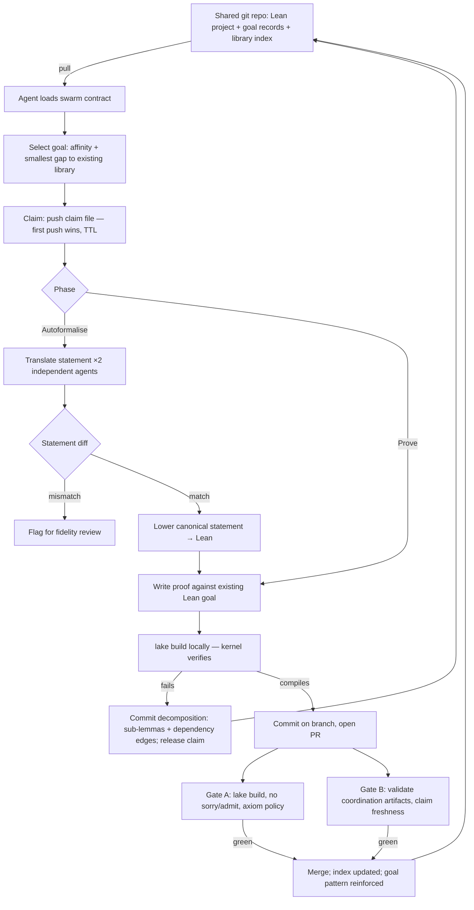

# Distributed Autonomous Research Swarm: Architecture and Plan (Revised)

A minimum-viable design for a distributed team of autonomous Claude instances that pick up, solve, verify, and pool research work from a shared repository, fully automated. This revision keeps the original recommendation and architecture, tightens the two weakest points (statement fidelity and swarm coordination), and adds a concrete mechanism for the self-sharpening work queue.

## Recommendation

Run the swarm on **formal mathematics in Lean 4**, contributing machine-verified proofs to a shared library (mathlib-style). Begin with **autoformalisation** of already-known-true theorems as the on-ramp, then graduate to **open lemmas and the decomposition of target theorems** once the loop is stable.

This remains the one problem where an autonomous agent can verify its own output exactly, cheaply, and locally, with no human and no laboratory in the cycle:

- **It carries its own verifier.** The Lean kernel decides correctness deterministically: a proof compiles or it does not.
- **The commons cannot be poisoned.** Every contribution is re-checked by the kernel on merge, so a careless or adversarial participant cannot corrupt the shared library.
- **It compounds.** Every proved lemma becomes an importable dependency; hard goals that resist proof are split into sub-lemmas that re-enter the queue.
- **It is maximally reasoning-bound.** Proving theorems rewards the most capable model directly.
- **The infrastructure is git.** The repo is the work queue, the coordination layer, and the source of truth.

The honest caveat on benefit stands: formal mathematics is an enabling public good (verified software and cryptography, a clean substrate for AI reasoning, an error-free mathematical record), not a direct-welfare moonshot like curing a disease. The criteria favour architecture-fit over directness of benefit, which is the correct call for this design, but the tradeoff should be deliberate. The benefit is real and lasting; it sits upstream of human welfare rather than at the point of delivery.

## Selection criteria (consolidated)

The recommendation and the ranked comparison below are scored against the full criteria set assembled across the brief:

1. **Benefit to humanity**: size and reach of the payoff.
2. **Needs the smartest models**: frontier reasoning is the bottleneck, not raw compute or physical labour.
3. **Decomposable into async units**: work splits into small, independent, claimable tasks.
4. **Self-verifying in software**: an agent can confirm its own output cheaply and deterministically, with no lab and no human. This is the gating criterion.
5. **Compounding pool**: pooled results retarget and accelerate the next round, not merely accumulate.
6. **Minimal infrastructure**: git plus a local verifier, dead-simple check-in and check-out, no central judge.

## Design principles

1. **The verifier is the coordinator, and the repository is the single source of truth.** No central scoring service, no per-unit human review, no database or queue server.
2. **The kernel is the only truth oracle.** Nothing else in the system — linters, tiers, metadata, scores — is ever load-bearing for mathematical correctness.
3. **Coordination artifacts are machine-validatable, not prose.** Claims, goal records, decomposition records, and the swarm contract itself are written in a formal specification notation (AISP, see Components §4) and linted deterministically in CI. Prose metadata in a heterogeneous, untrusted swarm drifts; with 40–65% per-hop ambiguity compounding over an 8-step agent loop, drift is the default failure mode, not an edge case.

## High-level architecture

## Components

### 1. Shared goal repo (git)

Holds the Lean project (mathlib as a dependency) plus:

- `goals/<id>.aisp` + `goals/<id>.lean` — a paired record per open target: the formal statement, status, source, difficulty, and typed dependency edges in the spec file; the statement with a `sorry` in the Lean file.
- `backlog/` — natural-language theorems awaiting formalisation (Phase 1 input).
- `claims/<goal-id>.<agent-id>.aisp` — claim files with timestamp and TTL. First push wins; a rejected push means someone beat you, so pick another goal.
- `library/index/<sha256>.aisp` — one content-addressed entry per merged lemma (id = SHA-256 of the canonical statement), carrying tags, use count, and an affinity score. Advisory only; never load-bearing for soundness.
- `swarm/protocol.aisp` — the swarm contract: the agent loop, claim semantics, TTLs, attempt/token budgets, decomposition rules, and CI policy, written once and loaded by every agent at session start.

### 2. Agent loop (per researcher)

A shell loop running Claude Code headless: pull, select, claim, attempt, verify locally with `lake build`, commit on success, release and decompose on failure, repeat. Goal selection ranks unclaimed goals by affinity and by how much of the target is already covered by the merged library (smallest viable gap first).

### 3. Verification gates (CI)

- **Gate A — soundness (non-negotiable).** Full `lake build`; reject `sorry`/`admit`; reject new or non-standard axioms; report each proof's axiom footprint. This is the trust boundary that makes untrusted contribution safe.
- **Gate B — coordination hygiene.** Deterministic validation of goal records, claims, decomposition records, and index entries (`aisp-validator`, sub-10 ms per file, no LLM in the loop); claim-freshness checks; schema checks on dependency edges. Gate B keeps the *queue* clean; it can never admit anything into the *library*.

### 4. Coordination format: AISP

The coordination artifacts above are written in AISP, a fixed-alphabet symbolic specification notation (512 symbols of standard formal logic/type theory, deterministic grammar, published validator tooling on npm and crates.io). It is used here for exactly three properties:

- **Deterministic parse.** Every well-formed document has a unique AST, so "claimed", "blocked", and "expired" cannot mutate meaning across heterogeneous agents and model versions. Anti-drift is a stated protocol rule, not a hope.
- **Cheap machine validation.** Gate B runs in milliseconds with no model in the loop, consistent with the git-plus-local-verifier infrastructure budget.
- **Native to the consumer.** The alphabet is drawn from the same arXiv/Lean/Coq distribution frontier models already parse, so the format costs one ~19 KB context file per session, no fine-tuning.

One boundary must be explicit: **AISP is a communication format, not a truth verifier.** Its quality tiers certify well-formedness and density of a document, not the truth of what the document asserts. Tier scores gate coordination hygiene only; mathematical correctness is Gate A's job alone. (Full capability map and caveats in Appendix A.)

### 5. Statement-fidelity gate

The kernel verifies the proof, not that the Lean statement faithfully captures the intended English — the one genuine soundness gap in the scheme. The revised mitigation makes the check mostly automatic:

1. Two independent agents each translate the English statement into the formal notation.
2. Normalize (α-rename, canonical symbol table) and diff the two statements. A deterministic grammar makes this diff meaningful in a way that diffing prose paraphrases is not.
3. **Match** ⇒ the canonical statement is lowered to Lean by one agent. **Mismatch** ⇒ flag for the (rare) human or peer check.
4. Optionally, back-translate the final Lean statement and diff against the canonical form.

Human attention is spent only on flagged disagreements instead of sampling everything.

### 6. Compounding mechanism

Merged lemmas are immediately importable on the next pull, and failed hard goals are decomposed into claimable sub-lemmas — unchanged. The revision adds the mechanism that makes the queue actually self-sharpen rather than merely accumulate:

- **Affinity scoring.** A merge adds +1 affinity to the goal pattern and decomposition that produced it; a failed attempt subtracts 10. Patterns that fall below the viability threshold are skipped and re-queued for re-decomposition instead of burning agent budget. The asymmetry deliberately favours proven approaches.
- **Gap-based selection.** Agents prefer goals whose distance from the already-merged library is smallest; goals with no nearby lemmas are deprioritized until decomposition brings them in range.
- **Stale-claim expiry.** Claims carry TTLs; expired claims are reaped by CI, so an agent that dies mid-attempt cannot park a goal forever.

### 7. Library index

The kernel guarantees a merged proof is *true*; content addressing guarantees the artifact an agent later *fetches* is the artifact that was verified. Each index entry's id is the SHA-256 of its canonical statement — tampering changes the id and orphans the entry. Usage and affinity metadata ride along for retrieval and prioritization but are never trusted for correctness.

## Method (per-cycle workflow)

Each Claude instance runs this loop:

1. **Pull** the latest repo state.
2. **Select** a goal: rank unclaimed goals by affinity and library-gap coverage.
3. **Claim** atomically (push the claim file; rejected push ⇒ pick another goal).
4. **Formalise** (Phase 1 only): translate per the statement-fidelity gate; stop and flag on mismatch.
5. **Prove**: attempt the proof, iterating locally against the compiler, within a fixed attempt and token budget.
6. **Verify**: run `lake build`. Proceed only on a clean kernel pass with no escape hatches.
7. **Check in**: commit on a branch and open a PR, triggering Gates A and B.
8. **On failure**: commit a decomposition record (sub-lemma statements plus typed dependency edges) so the attempt still feeds the pool; release the claim; affinity −10 on the failed pattern.
9. **Repeat.**

## Phasing

- **Phase 0 — coordination skeleton, no Lean (≈1–2 weeks, new).** Stand up the repo with the swarm contract, goal records, claims, and Gate B only. Run two agents doing translation-only work. Measure claim-collision rate, validator pass rate, and the statement-diff false-positive rate on deliberately identical inputs. This shakes out the cheapest loop first, before paying any Lean toolchain cost.
- **Phase 1 — autoformalisation.** 20–50 known-true theorems in the backlog; 3–5 agents; fidelity gate on; Gate A live. Targets are known-true, so risk is low while the team builds the loop, dedup discipline, and CI gates.
- **Phase 2 — open lemmas and target theorems.** Point the swarm at a chosen unformalised result and drive toward it by decomposition, with affinity-weighted selection fully on.

## Soundness: what must be right

- **No escape hatches.** CI must forbid `sorry`, `admit`, and any new or non-standard axioms, and should report each proof's axiom footprint. The verifier is only as sound as this policy.
- **Statement fidelity.** Handled by the dual-translation gate (§5); the residual human check applies only to flagged mismatches. This remains the scheme's one genuine soundness gap — now small, well-localised, and mostly automated.
- **Never confuse hygiene with truth.** A coordination artifact passing Gate B says nothing about mathematics. Only Gate A admits content to the library.

## Ranked comparison

Legend: ✅ pass · ⚠️ partial or weak · ❌ fail. The gating criterion is **Self-verifying**.

| # | Approach | Benefit | Top models | Decomposable | Self-verifying | Compounding | Min infra | Decisive factor |
|---|----------|:---:|:---:|:---:|:---:|:---:|:---:|---|
| 1 | **Formal mathematics (Lean) ★** | ⚠️ | ✅ | ✅ | ✅ | ✅ | ✅ | Exact local verifier plus compounding library, git-native. Cleanest fit. |
| 2 | Algorithm and construction discovery | ⚠️ | ✅ | ✅ | ⚠️ | ✅ | ✅ | Same loop, more tangible benefit; auto-scorer is softer than a kernel. |
| 3 | Open-source software improvement | ⚠️ | ✅ | ✅ | ⚠️ | ⚠️ | ✅ | Lowest-friction to stand up; tests are a gameable oracle. |
| 4 | De novo protein / enzyme design | ✅ | ⚠️ | ✅ | ❌ | ⚠️ | ❌ | Needs a wet-lab signal to close the loop; no in-software oracle. |
| 5 | Small-molecule drug discovery | ✅ | ⚠️ | ✅ | ❌ | ⚠️ | ❌ | Only approximate simulators as oracle; compute-bound. |
| 6 | Materials discovery / superconductivity | ✅ | ⚠️ | ✅ | ❌ | ⚠️ | ❌ | Validation is physical; in-silico checks are approximate and costly. |
| 7 | Antimicrobial resistance / antibiotics | ✅ | ⚠️ | ✅ | ❌ | ⚠️ | ❌ | Discovery decomposes, but confirmation is physical. |
| 8 | Brain mapping / connectomics | ⚠️ | ❌ | ✅ | ❌ | ❌ | ❌ | Additive pooling, no self-sharpening; verification is not autonomous. |
| 9 | Pure-insight monoliths plus fusion | ✅ | ⚠️ | ❌ | ❌ | ❌ | ❌ | Core insight not decomposable, fusion capital-locked; no automatic oracle. |

Row 9 covers P versus NP, the Riemann Hypothesis, quantum gravity, and practical fusion.

The coordination machinery in this revision (Components §4–§7) is domain-neutral: it would help options 2 and 3 just as much, and it does not reorder the table. The gating criterion is still decided by the verifier, and only Lean's kernel passes it cleanly.

## Down-selected options, in brief

**Algorithm and construction discovery (rank 2).** Claude proposes a program or construction, an automatic evaluator scores it, and the best feed back in as seeds. This is the exact swarm loop, and it has produced genuinely new results (larger cap sets, improved bin-packing, and later better matrix-multiplication routines in the FunSearch and AlphaEvolve line of work). The benefit is more tangible than formal maths, since faster algorithms ripple into real compute everywhere. It ranks second only because the evaluator is a scoring harness rather than a kernel, so a swarm can overfit a weak score: validity is checkable but optimality is not certifiable. A strong choice if tangible payoff matters more than verifier purity.

**Open-source software improvement (rank 3).** Agents fix bugs, close issues, and improve performance against a project's own test suite, with CI as the gate (the SWE-bench shape). Infrastructure is trivial and the work is reasoning-bound and directly useful. It ranks third because tests are the weakest of the three oracles: green tests do not prove correctness, so a swarm can overfit the suite. Excellent as the lowest-friction way to stand up and stress-test the whole machine before committing to maths.

**De novo protein and enzyme design (rank 4).** The top pick under the earlier human-plus-laboratory framing: each design target is independent and immensely beneficial (bespoke drugs, plastic-degrading and carbon-fixing enzymes). It falls here because the ground-truth signal is physical. An autonomous Claude can propose designs but cannot confirm them, so the loop cannot close in software and unverified guesses would accumulate in the repo.

**Small-molecule drug discovery (rank 5).** Virtual screening across vast compound libraries is embarrassingly parallel and high-benefit, but the only in-software oracles (docking and related scores) are poor proxies for reality, so a swarm would Goodhart them. The real signal is again physical assay, and the heavy lifting is compute, not frontier reasoning.

**Materials discovery, including room-temperature superconductivity (rank 6).** The in-silico layer parallelises well and the payoff is large (energy, grid, computing), but empirical validation through synthesis and characterisation is centralised in expensive laboratories, and the simulators that could serve as a verifier are approximate and costly. Compute-bound rather than reasoning-bound.

**Antimicrobial resistance and new antibiotics (rank 7).** High and rising stakes, and discovery decomposes well (screen libraries, sample environments, pool results). It fails the same gate: confirmation that a candidate actually works is a physical experiment, not something an agent can verify in software.

**Brain mapping and connectomics (rank 8).** Genuinely decomposable and historically crowdsourced, but it is additive pooling that assembles a map rather than a loop that retargets the next round, automated tracing is steadily eroding the value of distributed human or agent labour, and there is no cheap deterministic oracle an agent can run to verify a reconstruction.

**Pure-insight monoliths and fusion (rank 9).** P versus NP, the Riemann Hypothesis, and quantum gravity are bottlenecked on a single structural insight whose shape cannot be predicted, so the work cannot be parcelled out against an unknown proof skeleton, and there is no automatic verifier for the core result. Practical fusion is decomposable across subsystems but capital-locked in a few large, expensive machines. All are poor fits for an automated software swarm.

## Metrics

| Metric | Tests |
|---|---|
| Merge rate, collision rate | Loop health (original metrics) |
| Fidelity-flag rate and flag precision | Whether the dual-translation gate earns its keep |
| Coordination-error rate (malformed claims, double-claims, misparsed goals, protocol violations) | Whether formal coordination artifacts beat prose in practice |
| Statement-diff false-positive rate | Whether normalization keeps flags rare enough to be actionable |

The third row doubles as an independent benchmark of the coordination format's published claims on a real, adversarial-ish workload — a publishable side result either way.

## Risks and mitigations

- **Statement-equivalence diffing is not a solved deterministic problem.** Two correct translations can differ in names and symbol choices. Mitigate: normalize before diffing; flag-don't-block; track the false-positive rate in Phase 0. Kill criterion: if flags exceed ~20% on identical-meaning pairs, drop to single translation plus Lean back-translation.
- **Two-hop translation (English → spec → Lean) can introduce its own errors.** Mitigate: keep the back-translation check; the kernel still catches everything except statement-meaning drift, which is what the gate exists for.
- **Prose-wrapped notation.** Agents may emit English-shaped strings inside formal blocks, inheriting prose ambiguity (a documented failure mode of the format). Mitigate: Gate B tier floor plus a lint on quoted-string density in goal records.
- **Tier gaming.** Density scores measure structure, not merit. Mitigate: tiers apply only to coordination artifacts and as a floor, never a ranking; mathematical merit is never scored by tier.
- **Toolchain bus-factor.** The validator packages are young. Mitigate: pin versions; a validator outage degrades queue hygiene, not soundness, since Gate B never guards the library.

## Suggested first milestone

Run **Phase 0** end-to-end: repo with the swarm contract (validated at Gold tier or better), ten backlog statements, claims-via-repo, Gate B in CI, two agents doing claim → translate → diff → check-in for a fixed budget. Success criteria: zero protocol-meaning disputes between agents, claim-collision handling works, statement-diff false-positive rate measured and under 20%. Then proceed to the original milestone — Phase 1 with 20–50 theorems and 3–5 agents, Gate A live, fidelity gate enabled, measuring merge and collision rates.

**Optional stretch (dogfooding):** seed the Phase 1 backlog with the coordination format's own published theorem set (15 claims covering beam-search termination, density monotonicity, tamper-evidence of content addressing, and adjunction laws). Machine-verifying them in Lean benefits both projects and sits in the right difficulty band for early autoformalisation.

## What deliberately did not change from the original plan

- **Lean 4 + mathlib as the domain and the kernel as the verifier.** Nothing in the coordination layer competes with the kernel; the gating criterion (exact, cheap, local self-verification) is still satisfied by Lean alone.
- **Git as queue, coordinator, and source of truth.** All new artifacts are plain UTF-8 text files riding in the same repo. No database, no queue server, no central judge.
- **The ranked comparison and down-selection** (above, carried over unchanged). The revision changes the plumbing of the winning option, not the ranking.

---

## Appendix A: Coordination-format capability map (AISP)

AISP 5.1 ("AI Symbolic Protocol", `AI_GUIDE.md` in this repository) is the notation chosen for the coordination layer. What it contributes, mapped to where the plan uses it:

| Capability | What it is | Where the plan uses it |
|---|---|---|
| Σ₅₁₂ alphabet + deterministic grammar | 512 fixed symbols of formal logic/type theory; unique AST per well-formed doc; claimed <2% ambiguity vs 40–65% for prose | All coordination artifacts (§Components 1, 4) |
| `aisp-validator` / `aisp-converter` (npm + Rust) | Deterministic validation in <1–10 ms, no LLM; tier grading | Gate B (§Components 3) |
| Block structure + evidence blocks | Self-certifying documents carrying their own quality metrics | Goal records, swarm contract |
| Agent enforcement + anti-drift rules | Spec/coordinate outputs must be AISP; symbols never change meaning; drift ⇒ reparse original | Swarm contract semantics (§Components 4) |
| Pocket architecture | Content-addressed units (id = SHA-256 of content, tamper ⇒ unreachable) with affinity/confidence/usage metadata | Library index (§Components 7) |
| Hebbian learning rules | +1 success / −10 failure affinity; below-threshold skip; staleness eviction | Compounding mechanism, claim expiry (§Components 6) |
| Ghost-intent search | Gap between target and holdings; no-match ⇒ prune | Gap-based goal selection (§Components 6) |
| Binding function | `Post(A) ⊆ Pre(B)` typed compatibility | Dependency edges in decomposition records |
| Error algebra | Typed errors with recovery paths (bad signature ⇒ quarantine) | Gate B failure handling |
| Cross-model alignment evidence | 98% semantic alignment across different vendors' models from one spec | The rag-tag, heterogeneous-contributor scenario |

**What AISP is not, for this plan's purposes:**

- **Not a truth verifier.** Evidence blocks, density scores, and tiers certify well-formedness, not mathematical truth. A top-tier document can assert a false theorem. The Lean kernel is the sole correctness oracle throughout.
- **Not an execution framework.** It does not run anything; the agent loop, CI, and build remain shell + git + `lake`.
- **Not independently audited.** The ambiguity-reduction and coordination-error figures come from the project's own evidence set; this plan treats them as directional and measures them independently (see Metrics).
